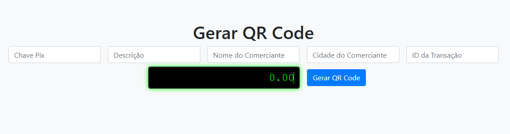
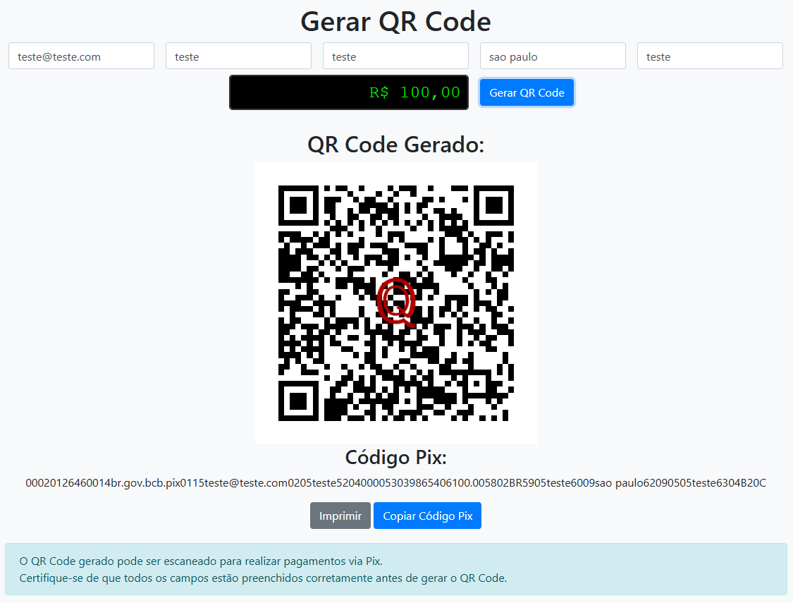
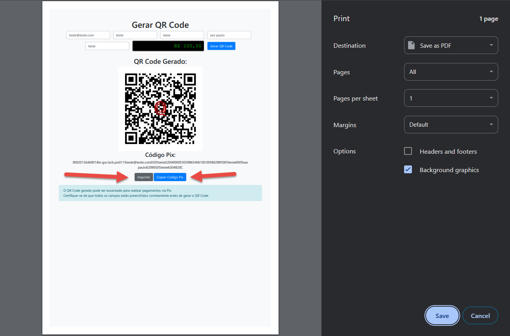

# Gerador de QR Code Payload Pix

Este projeto é uma aplicação web para geração de QR Codes do tipo Payload Pix, com suporte a personalização de dados do recebedor, valor, descrição, cidade, txid e inclusão de logo centralizado no QR Code. O sistema foi desenvolvido em PHP (backend) e HTML/JavaScript (frontend), utilizando Bootstrap para o layout e a biblioteca [mpdf/qrcode](https://github.com/mpdf/qrcode) para geração do QR Code.

---

## Funcionalidades

- **Geração de QR Code Pix**: Crie QR Codes Pix válidos para pagamentos instantâneos.
- **Personalização dos dados**: Informe chave Pix, nome do comerciante, cidade, descrição, txid e valor.
- **Valor formatado**: Campo de valor com formatação monetária.
- **Logo centralizado**: Insira automaticamente um logo no centro do QR Code (arquivo `logo.png`).
- **Exibição do código Pix**: O código Pix gerado é exibido e pode ser copiado para a área de transferência.
- **Impressão do QR Code**: Botão para imprimir o QR Code gerado.
- **Responsivo**: Interface adaptada para desktop e dispositivos móveis.
- **Retorno em JSON**: O backend retorna o QR Code em base64 e o código Pix em JSON, facilitando integrações.

---

## Demonstração

### Tela principal



### QR Code gerado com logo



### Código Pix e botões de ação



---

## Como usar

### 1. Clone o repositório

```sh
git clone https://github.com/SEU_USUARIO/payload-pix-qrcode.git
cd payload-pix-qrcode

 Instale as dependências PHP
composer install

3. Adicione seu logo
Coloque um arquivo logo.png (preferencialmente quadrado e com fundo transparente) na raiz do projeto.

4. Configure o servidor
Utilize Apache, Nginx ou o servidor embutido do PHP:
php -S localhost:8000

Acesse http://localhost:8000 no navegador.

Estrutura dos arquivos
payload-pix-qrcode/
│
├── app/
│   └── Pix/
│       └── Payload.php
├── vendor/
├── [index.html](http://_vscodecontentref_/0)
├── [generate.php](http://_vscodecontentref_/1)
├── [logo.png](http://_vscodecontentref_/2)
├── [composer.json](http://_vscodecontentref_/3)
└── docs/
    ├── tela-principal.png
    ├── qrcode-com-logo.png
    └── codigo-pix-botoes.png

Tecnologias utilizadas
PHP (>=7.4)
Composer
Bootstrap 4
jQuery
mpdf/qrcode
GD Library (para manipulação de imagens)
Observações
O arquivo logo.png é obrigatório para a geração do QR Code com logo centralizado.
O campo de valor aceita tanto ponto quanto vírgula como separador decimal.
O código Pix pode ser copiado para a área de transferência com um clique.
O projeto pode ser facilmente adaptado para integração com outros sistemas.
Licença
Este projeto está licenciado sob a MIT License.

Autor
Desenvolvido por Robertsoft.
